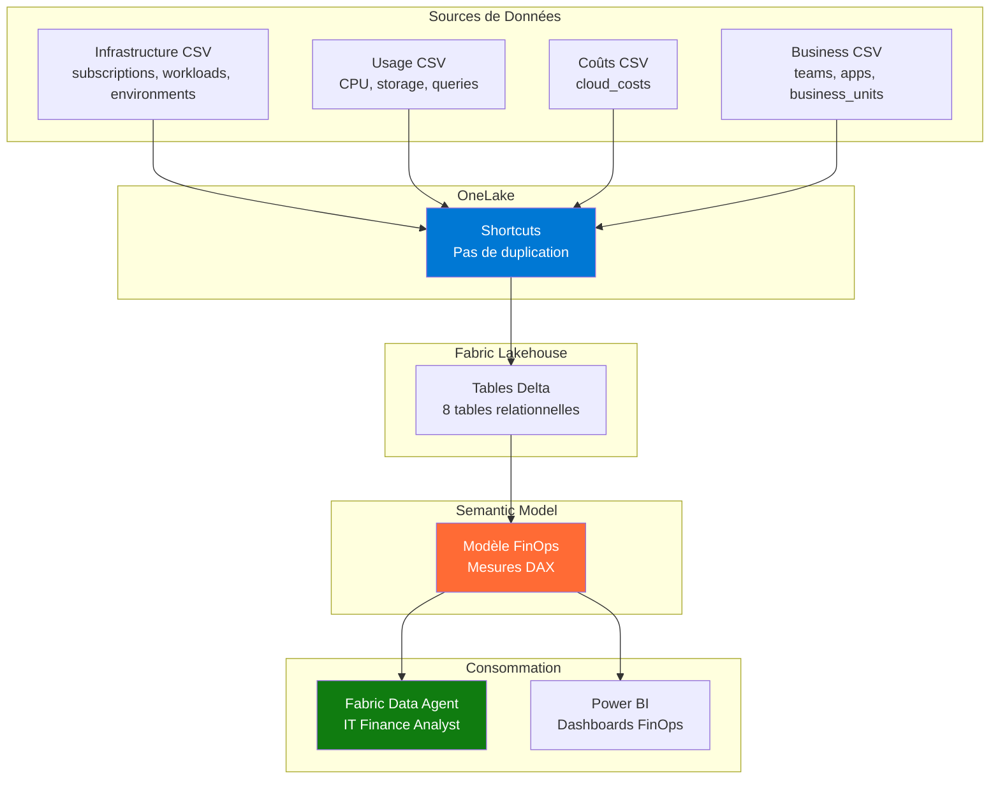

# IT Ops & FinOps - Démo Microsoft Fabric

[](https://fabric.microsoft.com/)
[](https://www.python.org/)
[](LICENSE)

> Démo complète de **Microsoft Fabric** avec OneLake, Modèle Sémantique FinOps, et Fabric Data Agent pour expliquer les coûts IT et leur valeur business.

---

## 🎯 Objectif de la Démo

Cette démo illustre comment **Microsoft Fabric** permet de :

1. **Unifier les données** IT (infrastructure cloud) et Business (applications, équipes) dans **OneLake**
2. **Analyser les coûts** par workload, application, équipe et business unit
3. **Interroger les données en langage naturel** avec le **Fabric Data Agent**
4. **Identifier les dérives** de coûts et opportunités d'optimisation

**Cas d'usage** : Expliquer pourquoi les coûts Fabric ont augmenté, identifier les workloads surdimensionnés, optimiser sans impacter le business.

---

## 🏗️ Architecture



**Flux de données** :
1. Génération locale de données synthétiques (Python)
2. Upload vers OneLake (via shortcuts ou direct)
3. Chargement en tables Delta
4. Création d'un modèle sémantique FinOps (relations + mesures)
5. Interrogation via Data Agent + visualisation Power BI

---

## 📊 Données Générées

| Type | Fichier | Volume | Description |
|------|---------|--------|-------------|
| **Infrastructure** | `subscriptions.csv` | 8 lignes | Abonnements Azure (dev, test, prod, shared) |
| | `environments.csv` | 15 lignes | Environnements (prod, preprod, dev, sandbox) |
| | `workloads.csv` | 120 lignes | Workloads Fabric/Azure (CU, stockage, queries) |
| **Usage** | `usage_metrics.csv` | ~36 000 lignes | Métriques quotidiennes (CPU, RAM, storage, queries) |
| **Coûts** | `cloud_costs.csv` | ~36 000 lignes | Coûts quotidiens par workload |
| **Business** | `business_units.csv` | 6 lignes | Unités business (Sales, Marketing, Finance, IT, HR, Ops) |
| | `teams.csv` | 30 lignes | Équipes (5 teams par BU) |
| | `applications.csv` | 60 lignes | Applications métier (2 apps par team) |

**Période** : 12 mois (février 2025 → janvier 2026)  
**Seed** : 42 (reproductibilité garantie)  
**Format** : CSV UTF-8, dates ISO 8601, noms de colonnes snake_case

### Relations Clés

```
subscriptions (1) ←→ (N) environments ←→ (N) workloads
workloads (1) ←→ (N) usage_metrics
workloads (1) ←→ (N) cloud_costs
applications (N) ←→ (1) workloads
applications (N) ←→ (1) teams ←→ (1) business_units
```

**Mapping coût → valeur business** :
- Chaque workload est lié à une ou plusieurs applications
- Chaque application appartient à une équipe
- Chaque équipe appartient à une business unit
- On peut ainsi calculer le coût IT par équipe, par BU, par application

---

## 🎬 Scénario de Démo

### 📈 Le Coût Fabric qui Explose

**Contexte** : En janvier 2026, le CFO constate une augmentation de 35% des coûts Fabric vs décembre 2025.

**Questions du CFO** :
- Pourquoi cette augmentation ?
- Quels workloads sont responsables ?
- Est-ce justifié par l'usage business ?
- Où peut-on optimiser sans impacter les utilisateurs ?

**Réponse avec Data Agent** :
1. Analyse des coûts par workload → identification des top 10 workloads les plus chers
2. Corrélation usage vs coût → workloads surdimensionnés (low usage, high cost)
3. Mapping vers les applications → quelles apps génèrent les coûts
4. Recommandations d'optimisation (downscale, archivage, consolidation)

---

## 📈 Analyses FinOps

### 1. Dérives de Coûts
- Détection automatique des augmentations anormales (> 20% M/M)
- Identification des workloads en croissance non contrôlée
- Alertes sur les dépassements de budget

### 2. Coût par Workload / Équipe
- Calcul du coût total par workload (compute + storage)
- Agrégation par team et business unit
- Comparaison budgets alloués vs réalisés

### 3. Usage vs Valeur
- Taux d'utilisation CPU, RAM, storage (% de la capacité provisionnée)
- Ratio coût / nombre de queries (efficacité)
- Workloads sous-utilisés (< 40% usage, coût > 1000€/mois)

### 4. Optimisations Possibles
- Downscale des CU (Capacity Units) sur les environnements dev/test
- Archivage des données anciennes (> 12 mois)
- Consolidation de workloads similaires
- Suppression des environnements sandbox non utilisés

---

## 🧠 Fabric Data Agent - "IT Finance Analyst"

Le Data Agent est configuré avec une personnalité d'**analyste FinOps** capable de :

### Compétences
- Expliquer les coûts IT en langage business
- Identifier les opportunités d'optimisation
- Justifier les investissements IT par la valeur business
- Détecter les anomalies et dérives budgétaires

### Questions Exemples (voir [questions_demo.md](docs/questions_demo.md))
1. **Analyse globale** : "Quel est le coût total Fabric pour janvier 2026 ?"
2. **Top contributeurs** : "Quels sont les 5 workloads les plus chers ?"
3. **Détection anomalies** : "Quels workloads ont augmenté de plus de 30% ce mois ?"
4. **Inefficacité** : "Quels workloads sont surdimensionnés (low usage, high cost) ?"
5. **Mapping business** : "Combien coûte l'équipe Marketing en infrastructure ?"
6. **Optimisation** : "Combien économiserait-on en supprimant les sandbox non utilisés ?"
7. **Justification** : "Le coût du workload 'Sales Analytics' est-il justifié vu l'usage ?"
8. **Tendances** : "Comment évolue le coût storage vs compute sur 12 mois ?"
9. **Budget** : "Quelles équipes ont dépassé leur budget IT ?"
10. **ROI** : "Quel est le coût par utilisateur actif pour l'app 'CRM Dashboard' ?"

---

## 🚀 Déploiement sur Microsoft Fabric

### Prérequis
- Workspace Fabric avec capacité F64 ou supérieure
- Lakehouse créé
- Permissions Contributor sur le workspace

### Étapes (voir [fabric_setup.md](docs/fabric_setup.md))

1. **Générer les données localement**
   ```powershell
   cd src
   python generate_data.py
   ```

2. **Uploader vers OneLake**
   - Créer des shortcuts vers les dossiers CSV
   - Ou uploader directement dans Files du Lakehouse

3. **Charger en tables Delta**
   - Créer des tables Delta depuis les CSV
   - Vérifier les schémas et types

4. **Créer le modèle sémantique**
   - Définir les relations (voir `schema.md`)
   - Créer les mesures DAX (voir `dax_measures.md`)

5. **Configurer le Data Agent**
   - Instructions système (voir `data_agent_instructions.md`)
   - Exemples de questions (voir `data_agent_examples.md`)

6. **Tester et valider**
   - Poser les 15 questions de démo
   - Vérifier la cohérence des réponses

---

## 📚 Documentation

| Document | Description |
|----------|-------------|
| [schema.md](docs/schema.md) | Dictionnaire de données (8 tables) |
| [demo_story.md](docs/demo_story.md) | Scénario "Le Coût Fabric qui Explose" |
| [questions_demo.md](docs/questions_demo.md) | 15 questions pour le Data Agent |
| [fabric_setup.md](docs/fabric_setup.md) | Guide de déploiement pas à pas |
| [dax_measures.md](docs/dax_measures.md) | Toutes les mesures DAX FinOps |
| [data_agent_instructions.md](docs/data_agent_instructions.md) | Prompt système du Data Agent |
| [data_agent_examples.md](docs/data_agent_examples.md) | Exemples de réponses attendues |
| [AGENTS.md](AGENTS.md) | Conventions de développement |

---

## 🛠️ Technologies Utilisées

- **Microsoft Fabric** : Lakehouse, Semantic Model, Data Agent, OneLake
- **Python 3.9+** : Génération de données (pandas, faker, pyyaml)
- **DAX** : Mesures FinOps (coûts, usage, ratios)
- **Power BI** : Visualisation des KPIs FinOps

---

## 📦 Installation Locale

```powershell
# Cloner le repo
cd "c:\Users\esigwald\OneDrive - Microsoft\Documents\03_Dev\09_DemoFabricDataAgent\MF_ITOps"

# Installer les dépendances
pip install -r requirements.txt

# Générer les données
cd src
python generate_data.py

# Vérifier les CSV générés
Get-ChildItem ../data/raw/*.csv | ForEach-Object { 
    Write-Host "$($_.Name): $((Get-Content $_.FullName | Measure-Object -Line).Lines - 1) lignes"
}
```

---

## 🎯 Résultats Attendus

Après génération des données :

```
data/
└── raw/
    ├── subscriptions.csv          (8 lignes)
    ├── environments.csv           (15 lignes)
    ├── workloads.csv              (120 lignes)
    ├── usage_metrics.csv          (~36,000 lignes)
    ├── cloud_costs.csv            (~36,000 lignes)
    ├── business_units.csv         (6 lignes)
    ├── teams.csv                  (30 lignes)
    └── applications.csv           (60 lignes)
```

**Taille totale** : ~5-8 MB  
**Temps de génération** : 20-30 secondes

---

## 🤝 Contribution

Pour modifier ou étendre cette démo :
1. Lire [AGENTS.md](AGENTS.md) pour les conventions
2. Modifier `src/config.yaml` pour ajuster les volumes/paramètres
3. Relancer `python generate_data.py`
4. Mettre à jour la documentation si nécessaire

---

## 📄 Licence

MIT License - Démo éducative Microsoft Fabric

---

## 👨‍💻 Auteur

Créé pour démontrer les capacités de **Microsoft Fabric** dans le contexte FinOps et gestion des coûts IT.
